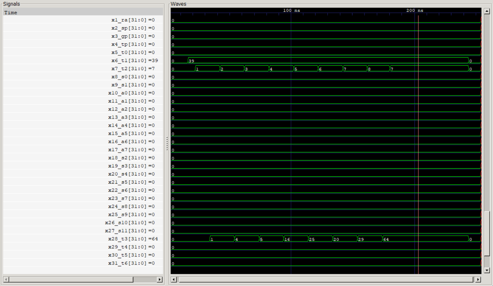

Computer Organization - Spring 2024
==============================================================
## Iran Univeristy of Science and Technology
## Assignment 1: Assembly code execution on phoeniX RISC-V core

- Name: Amirmohammad Salek Ardestani
- Team Members: Mahdi EbrahimiRavesh & Mohammad ArabZadeh
- Student ID: 400412265
- Date: 5/24/2024

## Report

# Quicksort Algorithm 

## Introduction to Quicksort
This document provides a detailed explanation of the RISC-V assembly code implementing the quicksort algorithm. Quicksort is a highly efficient sorting algorithm that operates using a divide-and-conquer strategy. The time complexity of quicksort is amortized \(O(n \log n)\) and worst case \(O(n^2)\). The space complexity is \(O(\log n)\) due to the recursion stack.

## Code Overview

The quicksort algorithm is implemented in the following steps:
1. **Main(Initialization)**: Store array values in contiguous memory.
2. **Quicksort Function**: Recursive sorting function.
3. **Partition Function**: Helper function to partition the array around a pivot.
4. **End**: Save the result and end the program.

### Main Program

The `MAIN` section initializes an array with five integer values and stores them in contiguous memory starting at address `0x0`. The array is then sorted using the quicksort algorithm.

### Quicksort Function

The `QUICKSORT` function is the core of the algorithm, which recursively sorts subarrays defined by `start` and `end` indices. The base case of the recursion is when `start` is not less than `end`.

### Partition Function

The `PARTITION` function rearranges the elements in the array so that all elements less than the `pivot` are on the left of the `pivot` and all elements greater than the `pivot` are on the right.

### End

The `End` section is used to loading sorted array in `s2-s6` registers and terminating the program.

# Integer Square Root

This document provides a detailed explanation of the RISC-V assembly code that calculates the integer square root of a given value using a simple iterative approach. The integer square root of a number \( n \) is the largest integer \( i \) such that \( i^2 \leq n \).

## Code Overview

The code performs the following steps:
1. **Initialization**: Load the value of \( n \) into a register and initialize necessary registers.
2. **Square Root Calculation Loop**: Incrementally test potential square root values until the correct integer square root is found.
3. **Completion**: Adjust the final result and store it in a register.

### Detailed Explanation

#### Initialization

The initialization section sets up the value of \( n \) and initializes registers used in the loop.

- `li t1, 39`: Load the value 39 into register `t1`, which represents \( n \).
- `li t2, 0`: Initialize `t2` to 0, which will be used to guess the square root.
- `li t3, 0`: Initialize `t3` to 0, which will store the square of `t2`.

#### Square Root Calculation Loop

The loop increments `t2` and calculates its square, comparing it with \( n \) to determine when to stop.

- `addi t2, t2, 1`: Increment `t2` by 1, representing the next guess for the square root.
- `mul t3, t2, t2`: Calculate the square of the current guess and store it in `t3`.
- `bge t3, t1, sqrt_done`: If the square of the guess (`t3`) is greater than or equal to \( n \) (`t1`), the loop exits.
- `j sqrt_loop`: If the square of the guess is less than \( n \), the loop continues with the next increment of `t2`.

#### Completion

Upon exiting the loop, the last increment of `t2` would have resulted in a value that is too large, so `t2` is decremented by 1 to get the correct integer square root.

- `addi t2, t2, -1`: Decrement `t2` by 1 to adjust for the overshoot in the loop. Now, `t2` holds the largest integer such that \( t2^2 \leq n \).

#### End of Program

The result, which is the integer square root of \( n \), is stored in `t2`.

- `ebreak`: This instruction is used to terminate the program. In a real system, this could be replaced with a suitable exit system call or handling mechanism.

